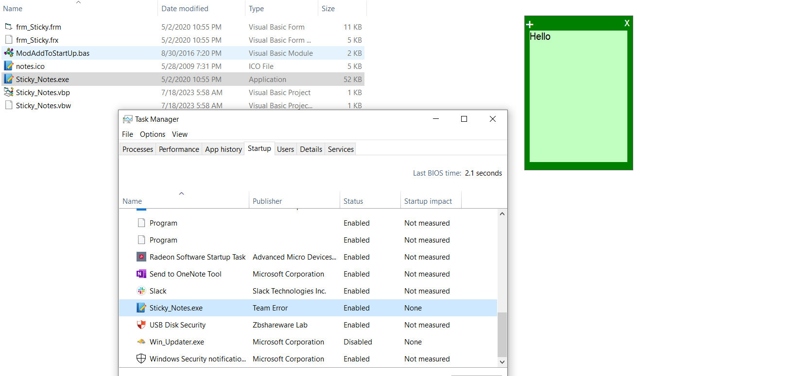

# Sticky Notes App

This is a Sticky Notes app developed in Visual Basic 6. It is a lightweight and open-source application that allows you to create and manage sticky notes on your desktop. With its user-friendly interface and essential features, it provides a convenient way to organize your tasks, reminders, and important information.

## Features

1. **Auto Startup**: The app can be configured to automatically start when you log in to your computer, ensuring that your sticky notes are always available.

2. **Multiple Window Supports**: You can open multiple sticky note windows simultaneously, allowing you to create separate notes for different purposes or categories.

3. **Multiple Themes**: The app offers a range of themes to personalize your sticky notes. You can choose from various color schemes and visual styles to suit your preferences.

4. **Copy, Paste, Select All Features**: You can easily manipulate the content of your sticky notes by utilizing standard editing features such as copying, pasting, and selecting all text.

5. **Lightweight & Open Source**: The app is designed to be lightweight, consuming minimal system resources. Additionally, it is an open-source project, which means the source code is available for you to study, modify, and contribute to its development.

## Screenshots

## Installation
To use this software, download from release section and open it as administrator. 

## Development

To use the Sticky Notes app, follow these steps:

1. Clone or download the repository to your local machine.

2. Ensure that you have Visual Basic 6 installed on your system.

3. Open the project in Visual Basic 6.

4. Compile and build the project to generate the executable file.

5. Run the generated executable file to launch the Sticky Notes app.

## Contribution

Contributions to this open-source project are welcome. If you have any suggestions, bug reports, or feature requests, please submit them through the project's GitHub repository. You can also contribute by fixing bugs, implementing new features, or improving the existing codebase. Fork the repository, make your changes, and submit a pull request for review.

## License

This Sticky Notes app is released under the [MIT License](LICENSE). You are free to use, modify, and distribute the application in accordance with the terms and conditions of the license.

## Support

If you encounter any issues or have questions about the app, feel free to open an issue on the GitHub repository. The project's community will be glad to assist you.

## Acknowledgements

We would like to express our gratitude to all the contributors who have helped develop and improve this Sticky Notes app. Your efforts and contributions are greatly appreciated.
